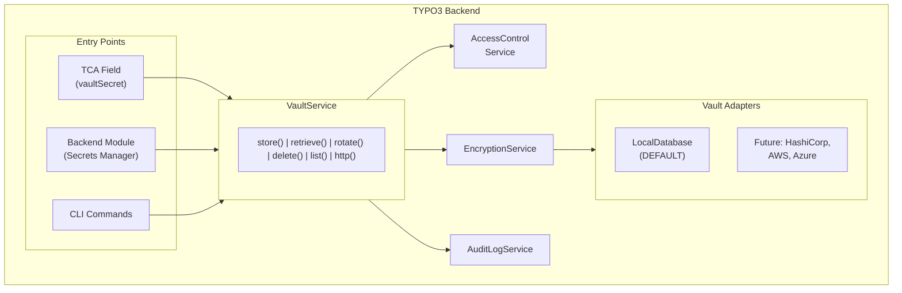
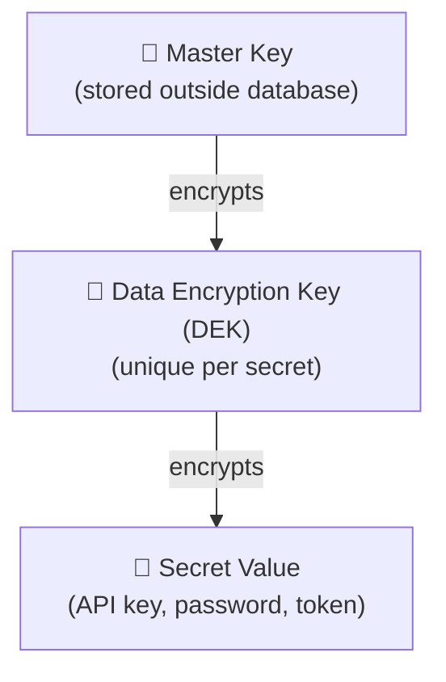

# nr-vault: Secure Secrets Management for TYPO3

[](https://github.com/netresearch/t3x-nr-vault/actions/workflows/ci.yml)
[](https://codecov.io/gh/netresearch/t3x-nr-vault)
[](https://securityscorecards.dev/viewer/?uri=github.com/netresearch/t3x-nr-vault)
[](https://www.bestpractices.dev/projects/11695)
[](https://typo3.org/)
[](https://www.php.net/)
[](https://phpstan.org/)
[](LICENSE)
[](https://github.com/netresearch/t3x-nr-vault/releases)
[](CODE_OF_CONDUCT.md)
[](https://slsa.dev)

*Enterprise-grade secret management without enterprise-grade complexity.*

## The Problem

Your TYPO3 site integrates with Stripe, SendGrid, Google Maps, and a dozen other services. **Where are those API keys right now?**

Probably in plain text in `LocalConfiguration.php`, unencrypted in a database field, or hardcoded somewhere accessible to every backend user.

If your database leaks, your secrets leak. If you need to rotate a compromised key, you're editing config files and redeploying.

## How Secrets Are Typically Stored

| Method | Security | Operational Reality |
|--------|----------|---------------------|
| **External Services** (HashiCorp Vault, AWS SM) | ⭐⭐⭐⭐⭐ | Infrastructure cost, network access, auth to service |
| **Environment Variables** | ⭐⭐⭐ | Deployment/host access required, restart to change, **no rotation UI, no audit trail** |
| **Files outside webroot** | ⭐⭐⭐ | Deployment/host access required, **hard to rotate, no management interface** |
| **nr-vault (encrypted DB)** | ⭐⭐⭐⭐ | Runtime manageable via TYPO3 backend, rotate anytime, full audit trail |
| **Plain text in config/DB** | ⭐ | ❌ No protection |

## Why nr-vault?

All "more secure" methods require either external infrastructure, deployment pipelines, or server access. And they all lack a management UI and audit trail.

| Challenge | Env Vars / Files | nr-vault |
|-----------|------------------|----------|
| **Rotate a compromised API key** | Call DevOps, redeploy, restart | Click in backend, done |
| **See who accessed a secret** | Check deploy logs (if any) | Full audit log with timestamps |
| **Emergency credential revocation** | Wait for deployment pipeline | Immediate via backend module |
| **Non-technical editor updates SMTP password** | Create support ticket | Self-service in backend |
| **Compliance audit: prove access history** | Manually correlate logs | Export tamper-evident audit trail |

## Solution

nr-vault provides:

- **Envelope encryption** with AES-256-GCM via libsodium
- **Master key management** (file, environment variable, or derived)
- **Per-secret access control** via backend user groups with context scoping
- **Audit logging** of all secret access with tamper-evident hash chain
- **Key rotation** support for both secrets and master key
- **TCA integration** via custom `vaultSecret` field type
- **Vault HTTP Client** - make authenticated API calls without exposing secrets
- **CLI commands** for DevOps automation
- **Pluggable adapter architecture** (external vault adapters planned for future releases)

## Architecture



## Encryption Model

Uses **envelope encryption** (same pattern as AWS KMS, Google Cloud KMS):



Benefits:
- Master key rotation only requires re-encrypting DEKs (fast)
- Each secret has unique encryption
- Compromise of one secret doesn't expose others

## Quick Start

### Store and Retrieve Secrets

```php
use Netresearch\NrVault\Service\VaultServiceInterface;

class MyService
{
    public function __construct(
        private readonly VaultServiceInterface $vault,
    ) {}

    public function storeApiKey(string $provider, string $apiKey): void
    {
        $this->vault->store(
            identifier: "my_extension_{$provider}_api_key",
            secret: $apiKey,
            options: [
                'owner' => $GLOBALS['BE_USER']->user['uid'],
                'groups' => [1, 2],  // Admin, Editor groups
                'context' => 'payment',  // Permission scoping
                'expiresAt' => time() + 86400 * 90,  // 90 days
            ]
        );
    }

    public function getApiKey(string $provider): ?string
    {
        return $this->vault->retrieve("my_extension_{$provider}_api_key");
    }
}
```

### Vault HTTP Client

Make authenticated API calls without exposing secrets to your code:

```php
use GuzzleHttp\Psr7\Request;
use Netresearch\NrVault\Http\SecretPlacement;
use Netresearch\NrVault\Http\VaultHttpClientInterface;

class PaymentService
{
    public function __construct(
        private readonly VaultHttpClientInterface $httpClient,
    ) {}

    public function chargeCustomer(array $payload): array
    {
        // Configure vault-based authentication (returns a new immutable client)
        $client = $this->httpClient->withAuthentication('stripe_api_key', SecretPlacement::Bearer);

        // Send a standard PSR-7 request - the secret is injected automatically
        $request = new Request(
            'POST',
            'https://api.stripe.com/v1/charges',
            ['Content-Type' => 'application/json'],
            json_encode($payload),
        );
        $response = $client->sendRequest($request);

        return json_decode($response->getBody()->getContents(), true);
    }
}
```

Secret placement options: `Bearer`, `BasicAuth`, `Header`, `QueryParam`, `BodyField`, `ApiKey`, `OAuth2`.

## TCA Integration

```php
'api_key' => [
    'label' => 'API Key',
    'config' => [
        'type' => 'input',
        'renderType' => 'vaultSecret',
        'size' => 30,
    ],
],
```

## CLI Commands

All 12 `vault:*` commands (full options and examples in
[`Documentation/Developer/Commands.rst`](Documentation/Developer/Commands.rst)):

```bash
# --- Setup ---
# Initialize the vault by generating a master key
vendor/bin/typo3 vault:init

# --- Secret CRUD ---
# Store a secret in the vault (value via --value, --stdin, --file, or interactive prompt)
vendor/bin/typo3 vault:store my_secret_id --value="s3cr3t-value"
# Retrieve a secret from the vault
vendor/bin/typo3 vault:retrieve my_secret_id
# List secrets in the vault (respects access control)
vendor/bin/typo3 vault:list
# Rotate (update) a secret
vendor/bin/typo3 vault:rotate my_secret_id --reason="Scheduled rotation"
# Delete a secret from the vault
vendor/bin/typo3 vault:delete my_secret_id

# --- Master key ---
# Rotate the master encryption key (re-encrypts all DEKs)
vendor/bin/typo3 vault:rotate-master-key --new-key=/path/to/new.key --confirm

# --- Migration & hardening ---
# Migrate an existing plaintext DB field value into the vault
vendor/bin/typo3 vault:migrate-field tx_myext_settings api_key
# Scan database and configuration for potential plaintext secrets
vendor/bin/typo3 vault:scan
# Clean up orphaned vault secrets from deleted TCA records
vendor/bin/typo3 vault:cleanup-orphans

# --- Audit ---
# Query and export vault audit logs (filter by --since / --until, Y-m-d)
vendor/bin/typo3 vault:audit --identifier=my_secret_id --since=2026-05-01
# Migrate the audit log hash chain from SHA-256 to HMAC-SHA256
vendor/bin/typo3 vault:audit-migrate-hmac
```

## Requirements

- **TYPO3**: v13.4 LTS / v14.3 LTS+
- **PHP**: ^8.2
- **Extensions**: `ext-sodium` (bundled with PHP)
- **CPU**: AES-NI support recommended (XChaCha20-Poly1305 fallback available)

## Documentation

Full documentation is available in the `Documentation/` folder and can be rendered with the TYPO3 documentation tools.

### Render locally

```bash
docker run --rm -v $(pwd):/project ghcr.io/typo3-documentation/render-guides:latest --progress Documentation
# Open Documentation-GENERATED-temp/Index.html
```

### Planning documents

Internal development documents are available in `docs/`:

- [Architecture](docs/architecture.md) - System architecture overview
- [API Reference](docs/api.md) - Service API documentation
- [Database Schema](docs/database.md) - Database structure
- [Security Considerations](docs/security.md) - Security design decisions
- [Use Cases](docs/use-cases.md) - Supported use cases

## Feature Comparison

| Feature | nr-vault | Drupal Key | Laravel Secrets | Symfony Secrets |
|---------|----------|------------|-----------------|-----------------|
| Envelope encryption | Yes | No | No | No |
| Per-secret DEKs | Yes | No | No | No |
| External vault support | Planned | Pluggable | Limited | HashiCorp |
| Access control | BE groups + context | By key | N/A | N/A |
| Audit logging | Full + hash chain | Limited | None | None |
| TCA/Form integration | Native | Form API | N/A | N/A |
| Key rotation CLI | Yes | Manual | Yes | Yes |
| HTTP client | Yes | No | No | No |
| OAuth auto-refresh | Yes | No | No | No |

## Roadmap

- **Phase 1-5**: Core functionality (current focus)
- **Phase 6**: External adapters (HashiCorp, AWS, Azure) + Optional Rust FFI for zero-PHP-exposure
- **Phase 7**: Service Registry - abstract away both credentials AND endpoints

## Installation

```bash
composer require netresearch/nr-vault
```

Or in DDEV:

```bash
ddev start
ddev install-v14
ddev vault-init
```

## License

GPL-2.0-or-later

---

**[n]** Developed by [Netresearch DTT GmbH](https://www.netresearch.de/) - Enterprise TYPO3 Solutions
